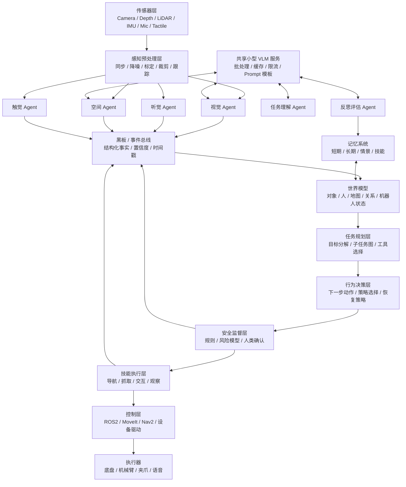
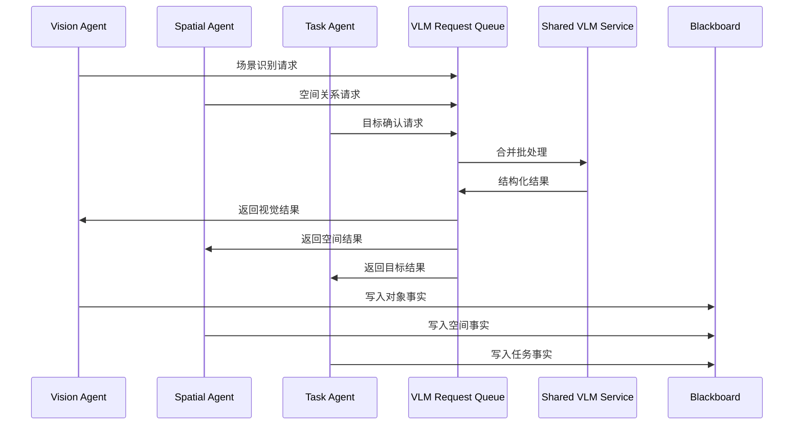
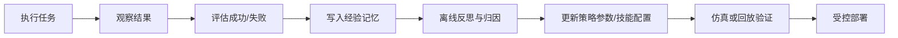

# 基于小型 VLM 的多 Agent 机器人脑部架构设计

## 1. 结论判断

用一个小型 VLM 作为通用视觉语言理解核心，再围绕它搭建多个专用 Agent，让不同 Agent 负责不同感官、任务、记忆、安全和执行链路，最后由几层高级决策层统一调度。

多个 Agent 不能凭空创造出基础模型本身没有的视觉、语言、空间和物理常识能力。多 Agent 的价值主要是把复杂问题拆开、并行处理、引入工具、加入记忆、做交叉验证、做状态管理和安全约束。也就是说，多 Agent 更像是“组织系统”和“认知流程”，不是替代更强模型的魔法。

- 小 VLM 负责视觉语言理解，例如物体识别、场景描述、目标定位、异常解释；
- 传统感知模块负责深度、SLAM、目标跟踪、姿态估计、碰撞检测；
- 多个 Agent 负责把感知结果变成结构化状态；
- 世界模型维护机器人当前认知；
- 任务规划层负责长期目标；
- 行为决策层负责短期动作选择；
- 控制执行层负责把行为落到机械臂、底盘、云台、夹爪等硬件；
- 安全监督层拥有最高优先级，可以否决任何危险动作；
- 自学习只在可审计、可回滚的记忆、参数配置、策略偏好和技能库中逐步发生。

## 2. 总体架构



## 3. 分层职责

### 3.1 传感器与预处理层

职责：

- 接入 RGB 相机、深度相机、LiDAR、IMU、麦克风、触觉传感器、编码器等；
- 完成时间同步、坐标系标定、图像裁剪、关键帧抽取、噪声过滤；
- 生成 VLM 可以消费的视觉输入，例如全图、目标 crop、前后帧对比图；
- 生成传统算法可以消费的数据，例如点云、深度图、语音流、关节状态。

建议：

- 不要把所有原始数据都丢给 VLM；
- 对 VLM 使用关键帧和目标区域；
- 对实时控制使用传统低延迟算法；
- 感知结果必须带时间戳、坐标系、置信度。

### 3.2 共享 VLM 服务层

小 VLM 不建议直接嵌入每个 Agent 内部，而应该作为一个共享服务。

核心能力：

- 统一模型加载，避免每个 Agent 重复占用显存；
- 提供异步请求队列；
- 支持批处理，把多个 Agent 的 VLM 请求合并推理；
- 提供 prompt 模板管理；
- 提供视觉缓存，相同图像或相同 crop 不重复推理；
- 提供超时、优先级和降级策略。

接口示例：

```python
class VLMRequest:
    image_refs: list[str]
    prompt: str
    schema: dict
    priority: int
    deadline_ms: int
    caller: str


class VLMResponse:
    result: dict
    confidence: float
    latency_ms: int
    model_version: str
    evidence_refs: list[str]
```

Agent 不应该只拿自然语言回答，而应该要求 VLM 输出结构化 JSON，例如：

```json
{
  "objects": [
    {
      "name": "red cup",
      "bbox": [120, 80, 210, 190],
      "state": "upright",
      "confidence": 0.82
    }
  ],
  "scene_summary": "A red cup is on the table near a book.",
  "risks": ["cup is close to table edge"],
  "uncertainty": ["handle direction is unclear"]
}
```

### 3.3 感官 Agent 层

每个感官 Agent 只负责一个相对清晰的问题，不要让一个 Agent 既看图、又规划、又控制机器人。

建议的感官 Agent：

- Vision Agent：场景理解、物体识别、目标属性描述、异常检测；
- Spatial Agent：空间关系、可达性判断、深度估计融合、地图对象绑定；
- Audio Agent：语音识别、声源方向、用户意图初步解析；
- Touch Agent：接触状态、滑动检测、抓取稳定性；
- Proprioception Agent：机器人自身状态、关节、电量、温度、速度、故障；
- Human Interaction Agent：人类姿态、手势、视线、社交距离和交互状态。

这些 Agent 可以并行运行，因为它们消费的是同一时刻的不同数据流，或者同一图像的不同 crop 和不同 prompt。

### 3.4 黑板与事件总线

多 Agent 系统最容易乱在“大家都在说话，但没有共同事实”。因此建议加入黑板系统，也可以理解为共享状态层。

黑板中保存：

- 当前观察到的对象；
- 对象位置和坐标系；
- 每个事实的来源 Agent；
- 每个事实的置信度；
- 更新时间；
- 是否被世界模型接纳；
- 是否存在冲突。

事实格式示例：

```json
{
  "fact_id": "obj_023_state_001",
  "type": "object_state",
  "subject": "obj_023",
  "predicate": "is_on",
  "object": "table_001",
  "confidence": 0.87,
  "source": "vision_agent",
  "timestamp": 1776427200.12,
  "frame_id": "camera_front",
  "expires_after_ms": 1500
}
```

### 3.5 世界模型层

世界模型是机器人脑部的核心，不应由 VLM 临时回答替代。

它维护：

- 机器人自身状态；
- 地图与空间拓扑；
- 对象实体及属性；
- 人类、动物、动态障碍物；
- 当前任务状态；
- 可用技能；
- 历史动作和结果；
- 不确定性和冲突。

建议使用混合表示：

- 短期状态：Redis、内存数据库、ROS topic cache；
- 实体关系：图数据库或轻量对象图；
- 空间状态：SLAM map、occupancy grid、semantic map；
- 长期记忆：向量数据库 + 元数据；
- 技能记忆：可版本化的技能配置和成功率统计。

### 3.6 高级决策层

可以分为三层，不建议只有一个“大脑 Agent”直接下命令。

第一层：任务规划 Task Planner

- 解析用户目标；
- 分解任务；
- 选择工具和技能；
- 生成子任务图；
- 判断是否需要询问用户。

示例：用户说“把桌上的红杯子拿给我”。

任务规划输出：

```json
{
  "goal": "deliver_object_to_user",
  "target_object": "red cup",
  "subtasks": [
    "locate_target_object",
    "navigate_to_table",
    "verify_grasp_pose",
    "grasp_object",
    "navigate_to_user",
    "handover_object"
  ],
  "requires_confirmation": false
}
```

第二层：行为决策 Behavior Planner

- 根据当前世界模型选择下一步动作；
- 在失败时选择恢复策略；
- 控制任务节奏；
- 将抽象子任务绑定到具体技能。

第三层：安全监督 Safety Supervisor

- 拥有否决权；
- 检查碰撞风险、速度限制、力矩限制、人类距离、危险物体；
- 对高风险操作要求人类确认；
- 检查模型输出是否越权。

安全监督不应依赖单一 VLM 判断，应结合规则、几何约束、传感器阈值和人工确认。

### 3.7 技能执行与控制层

高级决策层不应该直接控制电机，而应调用技能。

技能示例：

- `observe(scene_region)`
- `navigate_to(location)`
- `track_object(object_id)`
- `estimate_grasp_pose(object_id)`
- `grasp(object_id, grasp_pose)`
- `place(object_id, target_area)`
- `handover_to_human()`
- `ask_user(question)`
- `stop_all_motion()`

每个技能需要输出：

- success / failure / running；
- 执行耗时；
- 失败原因；
- 新观察；
- 是否需要重试；
- 是否触发安全事件。

## 4. 如何基于一个 VLM 并行搭建多个 Agent

关键点：多个 Agent 不是各自加载一个 VLM，而是共享同一个 VLM 推理服务。

推荐运行方式：



实现建议：

- 每个 Agent 是一个异步 worker；
- VLM 服务是单独进程或单独容器；
- 请求通过队列进入 VLM 服务；
- 支持优先级：安全相关 > 当前动作相关 > 背景理解；
- 支持 deadline：过期请求直接丢弃；
- 支持缓存：相同图像、相同 prompt、相同 crop 可以复用；
- 支持批处理：在 20-80ms 的窗口内收集请求统一推理；
- 支持降级：VLM 忙时只保留关键 Agent 请求；
- 输出必须结构化，避免让下游解析长文本。

异步伪代码：

```python
async def agent_loop(agent, blackboard, vlm_client):
    while True:
        observation = await agent.next_observation()
        request = agent.build_vlm_request(observation)
        response = await vlm_client.infer(request)
        facts = agent.parse_response(response)
        await blackboard.publish(facts)


async def vlm_scheduler_loop(queue, model):
    while True:
        batch = await queue.collect(
            max_batch_size=8,
            max_wait_ms=50,
            priority_order=True,
        )
        results = model.generate_batch(batch)
        await queue.dispatch(results)
```

## 5. 自学习与自适应设计

“自学习”要谨慎设计。机器人是真实物理系统，不能让模型在没有约束的情况下自动修改核心策略。

推荐分级：

### Level 0：无自学习

只执行固定策略，适合早期原型。

### Level 1：记忆自适应

机器人记住环境、用户偏好、物体常见位置、失败经验。

示例：

- “用户的水杯通常在左侧书桌”；
- “这个柜门需要先向上抬再拉”；
- “这个用户不喜欢机器人靠太近”。

### Level 2：参数自适应

根据历史成功率调整阈值和策略偏好，但要有范围限制。

示例：

- 抓取某类杯子的夹爪力度；
- 导航时与人保持的距离；
- VLM 置信度低于多少时必须重新观察。

### Level 3：技能库学习

通过人类示教、离线训练或仿真学习新增技能。新增技能必须经过测试、版本化和回滚。

### Level 4：模型微调

只建议离线进行，不建议机器人在线直接微调核心 VLM。可以定期收集失败样本，由人工审核后再训练。

推荐自学习闭环：



## 6. 推荐目录结构

后续如果要把这个架构实现成工程，可以使用如下结构：

```text
robotic_agent/
  README.md
  docs/
    multi_agent_vlm_robot_brain_architecture.md
    message_schemas.md
    safety_rules.md
  configs/
    agents.yaml
    vlm_service.yaml
    safety_limits.yaml
    skills.yaml
  src/
    brain/
      task_planner/
      behavior_planner/
      safety_supervisor/
      world_model/
      memory/
    agents/
      vision_agent/
      spatial_agent/
      audio_agent/
      touch_agent/
      proprioception_agent/
      human_interaction_agent/
    vlm_service/
      server.py
      scheduler.py
      prompts/
    blackboard/
      event_bus.py
      fact_store.py
      schemas.py
    skills/
      navigation/
      manipulation/
      observation/
      dialogue/
    control/
      ros_bridge/
      moveit_bridge/
      nav2_bridge/
    evaluation/
      replay/
      simulation/
      metrics/
  tests/
    unit/
    integration/
    simulation/
```

## 7. Agent 配置示例

```yaml
agents:
  vision_agent:
    enabled: true
    tick_hz: 5
    priority: 60
    vlm_prompts:
      - scene_summary
      - object_detection
      - anomaly_detection
    outputs:
      - object_fact
      - scene_fact
      - risk_fact

  spatial_agent:
    enabled: true
    tick_hz: 10
    priority: 70
    inputs:
      - depth_frame
      - object_tracks
      - robot_pose
    outputs:
      - spatial_relation_fact
      - reachability_fact

  safety_supervisor:
    enabled: true
    tick_hz: 50
    priority: 100
    can_override: true
    rules:
      - stop_if_human_too_close
      - stop_if_collision_predicted
      - require_confirmation_for_unknown_object
```

## 8. 一次任务的完整链路

任务：“把桌上的红杯子拿给我。”

1. Audio Agent 接收语音并识别文本。
2. Task Agent 抽取目标：红杯子、桌上、交给用户。
3. Vision Agent 调用 VLM 查找红杯子。
4. Spatial Agent 结合深度图判断红杯子的 3D 位置和是否可达。
5. World Model 注册对象 `red_cup_001`。
6. Task Planner 生成子任务：找杯子、导航、抓取、递交。
7. Behavior Planner 选择下一步：靠近桌子并重新观察。
8. Safety Supervisor 检查路径、人类距离、桌边风险。
9. Navigation Skill 执行移动。
10. Observation Skill 重新确认红杯子位置。
11. Grasp Skill 生成抓取姿态。
12. Safety Supervisor 检查夹爪轨迹和力矩限制。
13. Manipulation Controller 执行抓取。
14. Touch Agent 判断抓取是否稳定。
15. Behavior Planner 决定递交给用户。
16. Human Interaction Agent 判断用户手的位置和递交时机。
17. Safety Supervisor 控制速度和距离。
18. Handover Skill 完成交接。
19. Reflection Agent 记录本次任务成功经验。

## 9. 主要风险与应对

| 风险 | 表现 | 应对 |
| --- | --- | --- |
| 小 VLM 能力不足 | 识别错物体、理解错场景 | 多视角观察、传统检测器、置信度门控、用户确认 |
| 多 Agent 冲突 | 不同 Agent 给出矛盾事实 | 黑板事实版本、置信度融合、冲突仲裁 |
| 延迟过高 | 机器人反应慢 | VLM 批处理、缓存、关键帧、优先级队列 |
| 幻觉 | VLM 编造不存在的物体 | 结构化输出、证据图像、二次验证、空间一致性检查 |
| 自学习失控 | 策略越改越危险 | 版本化、回滚、离线验证、安全层不可学习化 |
| 真实世界安全 | 碰撞、夹伤、摔落物体 | 规则安全层、力控、急停、低速模式、人类确认 |

## 10. MVP 路线

建议不要一开始就做完整通用机器人脑。可以分三阶段。

### 阶段一：感知黑板 MVP

目标：

- 单相机输入；
- 一个共享 VLM 服务；
- Vision Agent；
- Spatial Agent 可以先用简单深度或模拟数据；
- 黑板保存对象和场景事实；
- 命令行查看当前世界状态。

验证标准：

- 能稳定识别桌面上 5-10 类物体；
- 能输出结构化 JSON；
- 能发现低置信度并请求重新观察。

### 阶段二：任务规划 MVP

目标：

- 加入 Task Planner 和 Behavior Planner；
- 支持 3-5 个固定技能；
- 支持失败重试；
- 支持用户确认。

验证标准：

- 能完成“找到某物”、“靠近某物”、“描述当前场景”等任务；
- 行为链路可追踪；
- 每一步都有事实依据。

### 阶段三：真实机器人闭环

目标：

- 接入 ROS2；
- 接入 Nav2 或 MoveIt；
- 加入 Safety Supervisor；
- 支持真实导航或机械臂动作；
- 加入任务回放和日志评估。

验证标准：

- 任意动作都能被安全层拦截；
- 失败任务可以回放；
- 自适应只影响记忆和有限参数，不直接改控制策略。

## 11. 推荐技术选型

可选方案：

- 机器人中间件：ROS2；
- 导航：Nav2；
- 机械臂规划：MoveIt 2；
- 多 Agent 编排：Python asyncio、Ray、LangGraph 或自研状态机；
- 消息总线：ROS2 topic/service/action、Redis Stream、NATS；
- 黑板存储：Redis、SQLite、PostgreSQL；
- 长期记忆：向量数据库 + SQLite/PostgreSQL 元数据；
- 语音：ASR + TTS；
- 仿真：Gazebo、Isaac Sim、MuJoCo；
- 评估：任务回放、场景回放、成功率统计。

早期建议：

- 如果主要目标是验证架构，用 Python asyncio + Redis + 一个 VLM HTTP 服务就够；
- 如果目标是接真实机器人，尽早接 ROS2；
- 如果目标是机械臂抓取，优先把 MoveIt 2 和安全层打通；
- 如果目标是移动机器人，优先把 Nav2、地图和障碍物安全做好。
